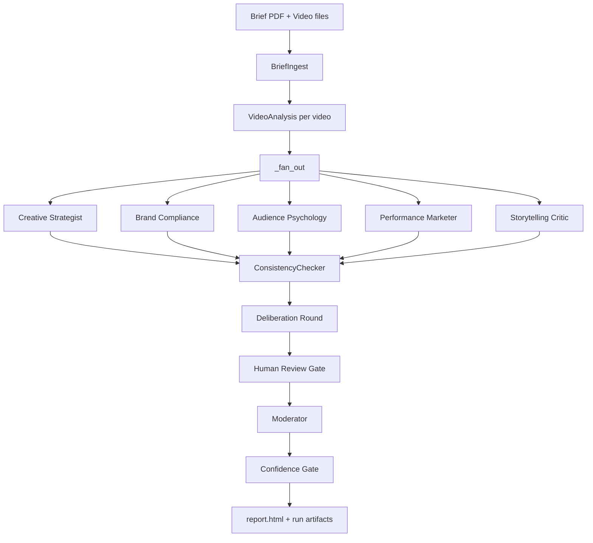

# Creative Jury Swarm

Multi-agent AI creative jury for evaluating video ads against a client brief, brand rules, audience fit, performance potential, and storytelling quality.

Creative Jury Swarm ingests a brief PDF and multiple video ads, runs a blind specialist jury, checks the agents for factual consistency, conducts a deliberation round, applies a deterministic auction score, and produces a ranked verdict with a self-contained report.

*LangGraph orchestration · Multimodal ad analysis · Auditable LLM evaluation*

---

## Why it exists

Creative review is usually subjective, hard to audit, and vulnerable to the loudest opinion in the room. This project turns that process into a structured evaluation system:

- Specialist agents score only the dimensions they own.
- The first scoring pass is blind, so agents cannot anchor on each other.
- A consistency checker flags contradictions before deliberation.
- A deterministic auction formula gives the Moderator a quantitative ranking to explain.
- Every run writes artifacts, metrics, checkpoints, and an LLM audit trail.

---

## Features

- **Brief ingestion**: parses a PDF brief into `brief.json`, `rubric.json`, and `brand_rules.json`.
- **Video analysis**: extracts metadata, frames, transcript signals, CTA detection, logo timing, and scene notes.
- **Parallel jury pass**: runs five specialist agents concurrently through LangGraph.
- **Consistency checking**: detects factual contradictions and score/narrative mismatches.
- **Deliberation round**: lets agents revise after seeing group scores and consistency flags.
- **Auction ranking**: computes `confidence_bid × conviction_bid / 100` for an auditable quantitative result.
- **Moderator verdict**: produces ranked recommendations, per-video summaries, and unresolved concerns.
- **Reports and UI**: writes a self-contained report and includes a live FastAPI jury room.
- **Production controls**: checkpoint resume, retries, circuit breaker fallback, config snapshots, OTel tracing, optional LangSmith traces, and JSON audit logs.

---

## Architecture



Five specialist agents score in parallel during the blind pass. The Consistency Checker audits their claims against the video dossier and their own scores. The Moderator reads the full jury record, uses the auction result as the primary quantitative signal, and writes the final client-facing verdict.

Complete system prompts for the jury agents live in [docs/agent_system_prompts.md](docs/agent_system_prompts.md).

---

## Tech stack

- **Python 3.10+**
- **Typer** and **Rich** for the CLI
- **LangGraph** with SQLite checkpointing for orchestration and resume
- **Anthropic Claude** for text, vision, and extended-thinking calls
- **Pydantic** for schema contracts
- **PyMuPDF**, **ffmpeg**, and optional **Whisper** for brief/video processing
- **FastAPI**, **Uvicorn**, and WebSockets for the jury room UI
- **OpenTelemetry**, **Jaeger**, **LangSmith**, and **structlog** for observability
- **pytest**, **ruff**, and **mypy** for test and quality tooling

---

## How to run

There are two ways to use Creative Jury Swarm. Start with the UI if you want a guided, non-technical workflow. Use the terminal if you want repeatable commands, automation, or tighter control over outputs.

### 1. Install

```bash
git clone <repo-url>
cd creative-jury-swarm
python -m venv .venv
source .venv/bin/activate
pip install -e .
```

`pip install -e .` is the app install command. The `requirements.txt` file is only for lightweight test tooling.

You also need `ffmpeg` on your `PATH` for video processing.

### 2. Configure once

Put your Anthropic key in a local `.env` file:

```bash
ANTHROPIC_API_KEY=<your-key>
```

Then configure and check the app:

```bash
creative-jury configure --non-interactive --provider anthropic --out-dir ./runs
creative-jury doctor
```

The CLI automatically loads `.env` from the directory where you run the command. Shell environment variables still win if the same key is set in both places.

`creative-jury` and `creative-jury-swarm` are the recommended commands. A shorter `cjs` alias is also installed, but on some systems another program already uses that name. If a command behaves like it is opening a file named `doctor` or `ui`, use:

```bash
python -m cjs.cli doctor
```

### Approach 1: Easy UI

Best for non-technical users, client reviews, and anyone who wants to upload files from a browser.

```bash
creative-jury ui
```

Then open `http://127.0.0.1:8000` if the browser does not open automatically.

In the UI:

1. Upload the brief PDF.
2. Upload two or more video ads.
3. Optionally upload a brand YAML.
4. Start the jury run.
5. Watch progress live and open the final report when the run completes.

The UI runs locally on your machine. Outputs are still written to `runs/<run_id>/`.

### Approach 2: Power-user terminal

Best for developers, repeatable evaluations, CI jobs, and anyone who wants exact command history.

Create or review a brand file:

```bash
creative-jury brand init --brief brief.pdf --out brand.yaml
```

Review the generated YAML before using it in a run.

Run the jury:

```bash
creative-jury run --brief brief.pdf --videos ad1.mp4 --videos ad2.mp4 --brand brand.yaml
```

Useful terminal options:

```bash
creative-jury run --brief brief.pdf --videos ad1.mp4 --videos ad2.mp4 --brand brand.yaml --auto-approve
creative-jury run --brief brief.pdf --videos ad1.mp4 --videos ad2.mp4 --brand brand.yaml --strict-confidence
creative-jury --json run --brief brief.pdf --videos ad1.mp4 --videos ad2.mp4 --brand brand.yaml
```

The run writes artifacts to `runs/<run_id>/` and opens the report when complete.

---

## Docker

Start Jaeger for local traces:

```bash
docker compose up jaeger
```

Run the CLI in the app container:

```bash
ANTHROPIC_API_KEY=<your-key> docker compose run --rm \
  --volume "$PWD:/work" \
  --workdir /work \
  app run \
    --brief brief.pdf \
    --videos ad1.mp4 \
    --videos ad2.mp4 \
    --brand brand.yaml
```

Jaeger is available at `http://localhost:16686`.

---

## CLI commands

| Command | Description |
|---|---|
| `creative-jury configure` | Create or update `~/.cjs/config.yaml` |
| `creative-jury doctor` | Check Python, ffmpeg, Whisper, config, API key, and run directory |
| `creative-jury brand init --brief brief.pdf` | Generate a starter brand YAML |
| `creative-jury run --brief ... --videos ... --brand ...` | Run the full jury pipeline |
| `creative-jury resume <run_id>` | Resume from the last LangGraph checkpoint |
| `creative-jury ui` | Launch the live jury room web UI |
| `creative-jury runs` | List previous run IDs |
| `creative-jury report <run_id>` | Print the report path for a run |
| `creative-jury audit <run_id>` | Show the LLM audit trail as a Rich table |
| `creative-jury models` | Show configured text and vision models |
| `creative-jury config get [key]` | Read all config or a dot-path value |
| `creative-jury config set <key> <value>` | Update a dot-path config value |

Most commands support machine-readable output through the root `--json` flag:

```bash
creative-jury --json runs
```

---

## Configuration

Configuration is stored in `~/.cjs/config.yaml`.

```yaml
provider: anthropic
models:
  text: claude-sonnet-4-6
  vision: claude-sonnet-4-6
  extended_thinking: claude-opus-4-7
auth:
  api_key_env: ANTHROPIC_API_KEY
limits:
  max_videos: 3
  max_duration_sec: 120
  max_frames: 12
  max_pdf_pages: 20
  max_file_mb: 200
run:
  out_dir: ./runs
```

Optional observability environment variables:

```bash
export OTEL_EXPORTER_OTLP_ENDPOINT=http://localhost:4317
export LANGCHAIN_TRACING_V2=true
export LANGCHAIN_API_KEY=<your-langsmith-key>
export LANGCHAIN_PROJECT=creative-jury-swarm
```

---

## Run output

```text
runs/<run_id>/
  input/
    brief.pdf
    videos/
      ad1.mp4
  brief/
    brief_raw.txt
    brief.json
    rubric.json
    brand_rules.json
  dossiers/
    ad1_dossier.json
  judgements/
    ad1_creative_strategist.json
    ad1_brand_compliance.json
  results/
    consistency_flags.json
    scorecards.json
    verdict.json
    metrics.json
    report.html
  audit.jsonl
  escalations.jsonl
  checkpoints.db
  config_snapshot.yaml
```

The report is self-contained and can be opened without an internet connection.

---

## Agent jury

| Agent | Role | Scoring dimensions | Extended thinking |
|---|---|---|---|
| Creative Strategist | Evaluates the creative idea and craft | Conviction bid only | No |
| Brand Compliance | Audits mandatory elements, claims, risk, and logo timing | `brief_compliance`, `brand_alignment` | Yes |
| Audience Psychology | Judges audience resonance and emotional fit | `audience_resonance`, `emotional_impact` | No |
| Performance Marketer | Reviews hook, CTA, value proposition, and platform fit | `message_clarity`, `performance_potential` | No |
| Storytelling Critic | Evaluates arc, pacing, payoff, and narrative coherence | `storytelling` | No |
| Consistency Checker | Flags contradictions and score/narrative drift | None | No |
| Moderator | Chairs the verdict and final ranking | None | Yes |

---

## Observability and auditability

```text
creative-jury run
  ├─ OTel spans -> OTLP gRPC -> Jaeger
  ├─ optional LangSmith traces -> results/metrics.json
  ├─ structlog JSON -> stdout or log aggregator
  └─ audit.jsonl -> creative-jury audit <run_id>
```

Each LLM audit entry records model, node, agent, token counts, latency, error state, and a SHA-256 prompt hash. Raw prompt text is not stored in the audit log.

---

## Project structure

```text
creative-jury-swarm/
  cjs/
    auction/          # deterministic auction engine
    escalation/       # human review and confidence gates
    graph/            # LangGraph state, nodes, and jury DAG
    observability/    # tracing, logging, LangSmith, audit trail
    pipelines/        # brief ingestion and video analysis
    report/           # report builder and HTML template
    router/           # model routing, retry, circuit breaker
    schemas/          # Pydantic contracts
    storage/          # run folders and SQLite index helpers
    ui/               # FastAPI jury room
    tests/            # unit and integration tests
  docs/
    agent_system_prompts.md
    production_build_plan.md
  ARCHITECTURE.md
  SECURITY.md
```

---

## Testing

```bash
pytest cjs/ -v -m "not integration"
pytest -m integration
ruff check .
mypy cjs
```

Integration tests require `ANTHROPIC_API_KEY`.

---

## Security and privacy

- API keys are read from environment variables named in `~/.cjs/config.yaml`.
- Briefs and videos are copied into the local run folder.
- ffmpeg and Whisper processing run locally.
- Frames, transcripts, and structured prompts are sent directly to the configured model provider.
- Audit logs store prompt hashes instead of raw prompt text.
- Run outputs are ignored by git by default.

See [SECURITY.md](SECURITY.md) for details.

---

## Further reading

- [ARCHITECTURE.md](ARCHITECTURE.md): component design, storage layout, and extension points
- [CONTRIBUTING.md](CONTRIBUTING.md): development workflow
- [CHANGELOG.md](CHANGELOG.md): notable changes
