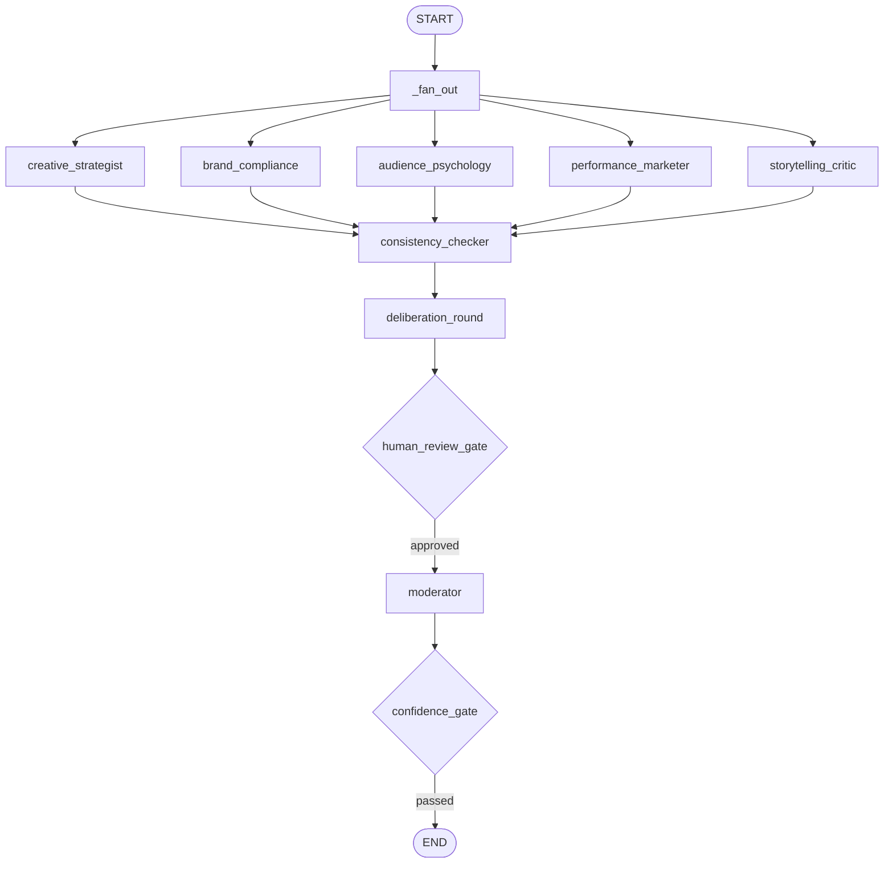

# Creative Jury Swarm

Multi-agent AI creative jury: brief + video ads → ranked verdict + self-contained HTML report.

*Frontier orchestration · Multimodal pipeline · Production observability*

---

## LangGraph jury flow



Five specialist agents score in parallel — blind, so no agent can anchor on another's score.
A Consistency Checker flags factual contradictions. A deliberation round lets each agent
revise. The Moderator (claude-opus-4-7 with extended thinking) synthesises the record and
delivers a ranked verdict. A pure-Python auction engine computes the final score from
confidence × conviction bids weighted by the rubric.

---

## Quick start

**Docker (recommended):**
```bash
cp .env.example .env        # fill in ANTHROPIC_API_KEY
docker compose up jaeger    # start OTel collector + Jaeger UI
cjs configure
cjs run --brief brief.pdf --videos ad1.mp4 ad2.mp4 --brand brand.yaml
```

**Local:**
```bash
pip install -e .
cjs configure
cjs run --brief brief.pdf --videos ad1.mp4 ad2.mp4 --brand brand.yaml
```

The report opens automatically in your browser when the run completes.

---

## Production engineering features

| Feature | Implementation |
|---|---|
| **Parallel scoring** | LangGraph `Send` API fans out to 5 agents simultaneously |
| **Checkpointing** | `SqliteSaver` — resume any interrupted run with `cjs resume <run_id>` |
| **Human-in-the-loop** | `human_review_gate_node` pauses when score delta > 3 or flags unresolved |
| **Circuit breaker** | `ModelRouter` opens after 5 failures; falls back to `claude-haiku-4-5` |
| **Retry with backoff** | `tenacity` exponential backoff on all LLM calls |
| **Extended thinking** | Moderator + Brand Compliance use `claude-opus-4-7` thinking budget |
| **Audit trail** | Every LLM call logged to `audit.jsonl`: model, tokens, latency, prompt hash |
| **Consistency checking** | Dedicated node flags factual contradictions and score/narrative drift |
| **Confidence gate** | Advisory (default) or blocking (`--strict-confidence`) after verdict |
| **Config snapshot** | `config_snapshot.yaml` written to every run folder at start |

---

## Observability stack

```
cjs run
  │
  ├─► OTel spans ──► OTLP gRPC ──► Jaeger  (localhost:16686)
  │
  ├─► LangSmith traces (optional — set LANGCHAIN_TRACING_V2=true)
  │     └─► run URL written to results/metrics.json
  │
  ├─► structlog JSON ──► stdout / log aggregator
  │
  └─► audit.jsonl ──► cjs audit <run_id>   (Rich table)
```

Start Jaeger locally: `docker compose up jaeger` then open `http://localhost:16686`.

---

## Commands

| Command | Description |
|---|---|
| `cjs configure` | One-time config (provider, models, limits) |
| `cjs run` | Run the jury: `--brief`, `--videos`, `--brand`, optional `--strict-confidence` |
| `cjs resume <run_id>` | Resume from last LangGraph checkpoint |
| `cjs audit <run_id>` | Show LLM call audit trail as a Rich table |
| `cjs runs` | List run folders (newest first) |
| `cjs report <run_id>` | Show report path for a run |
| `cjs config get [key]` | Read full config or a dot-path value |
| `cjs config set <key> <value>` | Update a config value |
| `cjs brand init --brief brief.pdf` | Generate starter brand YAML from a brief |
| `cjs doctor` | Environment checks (Python, ffmpeg, API key, runs dir) |
| `cjs models` | Show configured text/vision models |

---

## Run output

```
runs/<timestamp>/
  config_snapshot.yaml        # config at time of run
  brief/
    brief.json                # parsed brief
    rubric.json               # scoring dimensions + weights
    brand_rules.json          # mandatory / forbidden elements
  videos/
    ad1.mp4                   # copy of input
  video_dossiers/
    ad1_dossier.json          # transcript, scene metadata, logo timing, CTA
  checkpoints.db              # LangGraph SQLite checkpoint
  escalations.jsonl           # human review and confidence gate events
  audit.jsonl                 # one line per LLM call
  results/
    scorecards.json           # auction scores per agent per video
    verdict.json              # winner, ranking, rationale
    metrics.json              # token cost, latency, langsmith_url
    report.html               # self-contained — no internet required to open
```

---

## Agents

| Agent | Persona | Scoring dimensions | Extended thinking |
|---|---|---|---|
| Creative Strategist | 15-year creative director | conviction bid only | — |
| Brand Compliance | Brand and legal specialist | `brief_compliance`, `brand_alignment` | claude-opus-4-7 |
| Audience Psychology | Behavioural researcher | `audience_resonance`, `emotional_impact` | — |
| Performance Marketer | Growth specialist | `message_clarity`, `performance_potential` | — |
| Storytelling Critic | Narrative analyst | `storytelling` | — |

→ [Full agent catalog, jury flow, and auction mechanics](AGENTS.md)

---

## Tests

```bash
pytest cjs/ -v -m "not integration"   # 176 unit tests, no API calls
pytest -m integration                  # requires ANTHROPIC_API_KEY
```

---

## Architecture

→ [Engineering philosophy and design decisions](SOUL.md)  
→ [Component interfaces, storage layout, extension points](ARCHITECTURE.md)  
→ [Contributing](CONTRIBUTING.md) · [Security](SECURITY.md)
